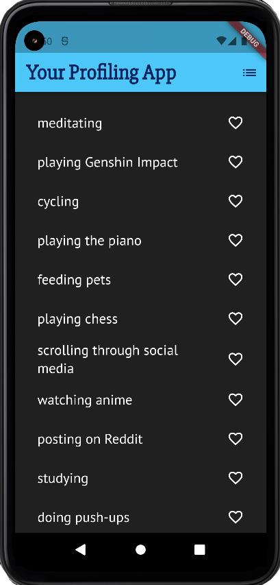
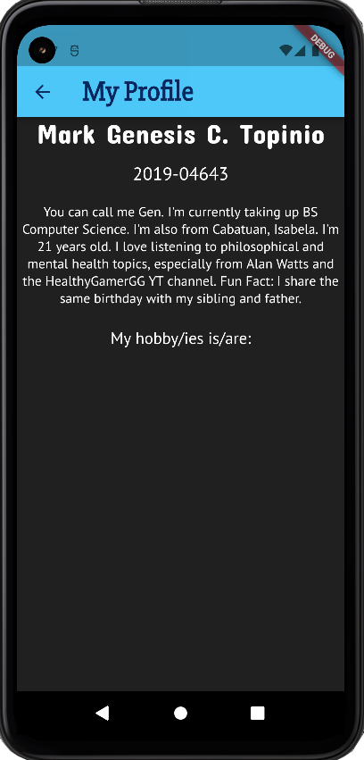
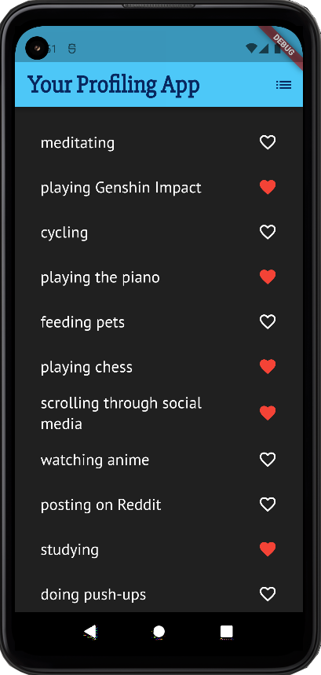
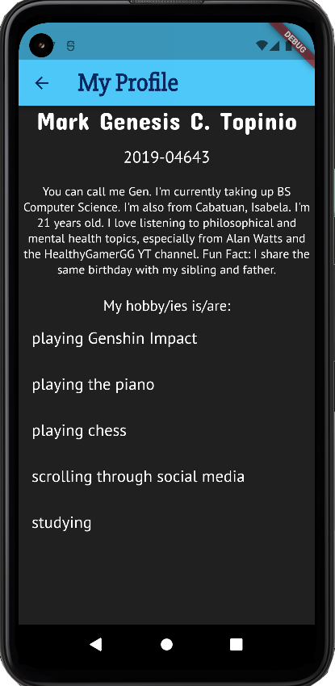

# Exercise 01 Your Profile App
### Mark Genesis C. Topinio
### 2019-04643
### WX1L

# Exercise Description
> For your exercise 1 you need to create an app named your profile app. At the start of the app, you need to select your hobbies. You are required to list at least 10 of your hobbies. Then when I click the navigation button (upper right button/icon). It will be redirected to a page. The page contacts My Profile as the header. Then it shows your name, student number, and a minimum 5 sentence description of yourself. Then all the hobbies you selected on the 1st page. The theme of your app should show your favorite colors. 

# Naming your App
```
surnameinitials_exer1_section e.g. (TANKLM_exer1_wx1).
TOPINIOMGC_exer1_wx1L
```

# Documentation
- **Screenhots of the Mobile App**<br/><br/>
    ### _First Run Preview_
     <br/>
    > In the app's first run, we can already see a list of the author's hobbies on the main page. The user can also scroll down the app to see more hobbies. There are precisely 12 hobbies that the user can select.
    <br/>
    ### _Secondary App Page_
     <br/>
    > When the user taps the "List" icon on the main page, it takes the user to the secondary app page. The page includes the author's name, student id, and more descriptions. The secondary page also acts as a container for the selected hobbies from the main page. A list of hobbies will only appear if the user has selected either a single or multiple hobbies from the main page.
    <br/>
    ### _Selectable Hobbies_
     <br/>
    > The user can select individual hobbies from the main page. The user can choose a hobby by either tapping the heart icon or the row of the hobby itself. The trailing heart icons will turn red if a hobby is selected from the main page.
    <br/>
    ### _Preview of Selected Hobbies on Secondary Page_
     <br/>
    > Every time the user has selected a hobby, the scrollable list of hobbies from the secondary page will also show the updated list of the author's hobbies. If the user unselects a hobby from the main page, the secondary page will also update its array of hobbies and only show the selected ones.
    <br/>


- **What did you add to the code?**

    >After implementing the codebase from CMSC 23 (ICS-UPLB), I added further tweaks and refinement to implement the project specifications. Here is the following **Explanation of the Classes and Libraries used:**
    - **MyApp** Class
        > **MyApp** builds the main widget tree of the application. It also includes the title, theme, and creates an instance of **Hobbies** to show the list of the author's hobbies.
    - **Hobbies** Class
        > **Hobbies**, along with **_HobbiesState**, is a Stateful widget that builds the rows of the author's hobbies. It also makes the app interactive as the user can tap/toggle a row or heart icon of that row to choose and save a hobby.Saved hobbies are then showed to another page of the application.
    - **_HobbiesState** State
        > **_HobbiesState**, working with **Hobbies**, is a State that holds the methods/widgets that build most of the features of the application. It holds the **list of hobbies**, **font properties**, and main **methods** that are used to populate the secondary page of the app.
    
        - **Methods/Widgets**
        > **__pushSaved_** is used to show another page called "My Profile", which shows the author's description and the saved hobbies from the main page.
        </br></br>
        > **build** is the widget that returns the scaffolding for the main page of the app.
        </br></br>
        **_buildRow** is a widget that accepts a string (_hobby_) and allows the main interaction between the user and the list of hobbies. If the user taps an unchosen hobby from the list, the icon next to it becomes red, and the string is saved into the list of chosen hobbies (i.e., __saved_). If the chosen hobby is tapped again, it will not be saved and the heart icon's color is removed.
        </br></br>
        **__buildSuggestions_** is a widget that creates a scrollable, linear array of widgets along with some padding.
    - **Material** Library
        > The **Material** library contains the Flutter widgets implementing **Material Design**. It is utilized to easily build the interface design and components of the application.
- **How are you able to do the exercise.**
    > At first, it wasn't easy to understand how Flutter works in a nutshell. I watched multiple tutorials from _The Net Ninja_ on YouTube to further hone my understanding. I played around with the widgets and examined the class's code template to know the nature of the syntax of Flutter.
- **Challenges met while doing the exercise.**
    > There were a lot of challenges met while doing the exercise, such as insufficient disk space and large resource consumption of the Android Emulator.
- **Happy paths and Unhappy paths encountered.**
    > **_Happy Path:_** Tap single or multiple hobbies -> successfully shown in secondary page
    </br>
    > **_Unhappy Path:_** _None_

:smile_cat: contact your lab instructor if you have any concerns, inquiries or problems in your exercise.
